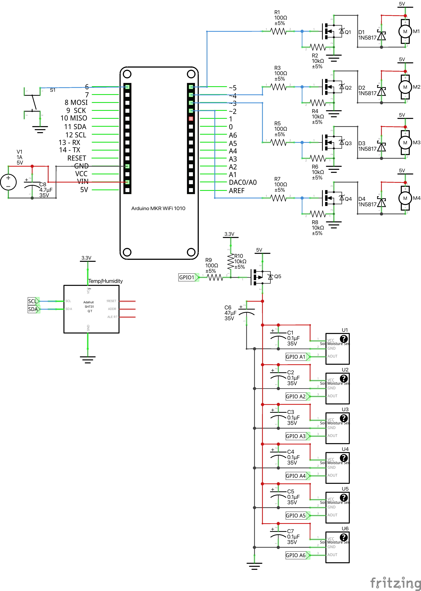

# Smart greenhouse

## Table of contents

- [Smart greenhouse](#smart-greenhouse)
  - [Table of contents](#table-of-contents)
  - [Description](#description)
  - [Components](#components)
  - [Wiring](#wiring)
  - [Strategy](#strategy)
  - [License](#license)

## Description

This is a smart greenhouse project that uses an Arduino MKR WiFi 1010 to monitor and control the environment of a greenhouse. The project includes temperature and humidity sensors, soil moisture sensors, water pumps, a fan, and an ultrasonic mister. The data is sent to AWS IoT core for monitoring.

## Components

- Arduino MKR WiFi 1010
- SHT3X Temperature and Humidity Sensor
- 6 Capacitive Soil Moisture Sensors
- 2 5V Water Pumps
- 1 5V Brushless Fan
- 1 5V Ultrasonic Mister
- 4 N-Channel MOSFETs
- 1 P-Channel MOSFET
- 4 Schottky Diodes
- 5 100Ω Resistors
- 5 10kΩ Resistors
- 6 0.1μF Capacitors
- 2 47μF Capacitors
- 1 Push Button
- 5V Power Supply

## Wiring

The circuit features a 5V power supply which directly powers the Arduino, the sensors, and the actuators. The Arduino controls 4 low-side MOSFETs to switch the pumps, fan, and mister on and off. The SHT3X sensor is connected to the Arduino via I2C. The soil moisture sensors are powered conditionally via a high-side MOSFET, which is controlled by the Arduino. Additionally, a push button is included to manually send data to AWS IoT core.

## Strategy

### Sensing Soil Moisture

The soil moisture sensors can give different readings depending on the soil density and the sensor placement (each plant has its own pot and moisture sensor). To get useful readings, the sensors are calibrated twice. The first calibration is done in dry air vs water—this ensures that we can reliably compare readings between sensors. The second calibration is done with dry vs wet soil—this allows us to determine watering thresholds for each sensor placement.

Although capacitive soil moisture sensors are less prone to corrosion than resistive sensors, they can still corrode over time. To mitigate this, the sensors are powered conditionally via a high-side MOSFET, which is controlled by the Arduino. This way, the sensors are only powered when needed.

### Watering Strategy

The watering strategy is mostly based around the fact that there are 6 plants and 2 pumps. I err on the side of underwatering rather than overwatering, as the latter can lead to root rot. The strategy is simple: Every 5 minutes, if the soil moisture is below a threshold for all sensors belonging to a pump, that pump is turned on for 3 seconds. Of course, each sensor has its own threshold, which is determined during the calibration process.

### Fan and Mister Strategy

The fan and mister are controlled by the SHT3X sensor. Each is enabled or disabled according to a hysteresis. i.e., if the temperature is above a certain threshold, the fan is turned on. If the temperature is below a certain threshold, the fan is turned off. The same applies to the mister, but with humidity instead of temperature.

## License

This project is licensed under the MIT License. See the [LICENSE](./LICENSE) file for details.
